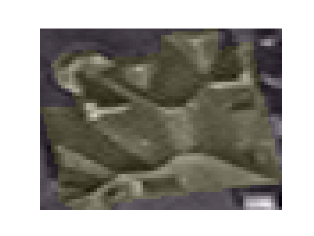

# Technical Test (Data Scientist) 

As part of the selection process, we require all candidates for Data Scientist positions to complete a technical test. 

Whilst completing the tasks below, we would like you to consider using the following software development techniques where it is sensible: 

* PEP8 coding conventions 
* Version control 
* Dependency management 
* Testing (we are not expecting 100% code coverage, one or two tests to demonstrate understanding is plenty) 

You can take as much time as you need to complete the exercises, but we’d suggest you spend no more than 2 hours even if you did not complete all the steps.

## Task 1: Explore geospatial data in a Jupyter Notebook 

This task is designed to assess your ability to interact with geospatial data.

### 1. Load the data 

Using [geopandas](https://geopandas.org/index.html) and [rasterio](https://rasterio.readthedocs.io/en/latest/index.html) load `data/buildings.sample.geojson` and `data/image.grey.tif` respectively. 

### 2. Inspect the data 

Output some appropriate summary information about each of the datasets. 

### 3. Plot the data 

Plot the image data from `image.grey.tif` with the building data from `buildings.sample.geojson` overlaid.  

Notes:

* Within the image data there are outliers, you will need to clamp them to properly visualise the data 
* The [rasterio.features.rasterize](https://rasterio.readthedocs.io/en/latest/api/rasterio.features.html#rasterio.features.rasterize) function can be useful for this task 

## Task 2: Build a simple model

This task is designed to test your modelling ability within a simple context.

In this task you will use building attributes (do not try and use the image) to infer the buildings roof material.

`data/buildings.csv` contains building data with the below attributes:

|            | Description               | Type
|------------|---------------------------| ------------ |
| roof_type1 | Roof geometry type        | Categorical  |
| address    | Address of the building   | Free Text    |
| latitude   | Latitude of the building  | Continuous   |
| longitude  | Longitude of the building | Continuous   |
| height_m   | Height of the building    | Continuous   |
| area_m2    | Area of the building      | Continuous   |
| city       | The city of the building  | Categorical  |
| roof_mat   | The roof material         | Categorical  |

Using the columns of your choice fit a model that can predict the `roof_mat` attribute.
 
Explain some of the expected strengths and the weaknesses of your model.

Explain what some sensible next steps would be to improve your model.

## Task 3: Write a data loading class

This task is designed to test your ability to write clean code relevant to data science pipeline.

In a new Python module `data.py` write a class `BuildingDataset` that loads one building at a time with an interface that enables the following interaction: 

Notes:
* You can load a portion of the image data using the [rasterio.windows](https://rasterio.readthedocs.io/en/latest/topics/windowed-rw.html) module

[in]:

```
import matplotlib.pyplot as plt

from data import BuildingDataset 

ds = BuildingDataset("data/image.grey.tif", "data/buildings.sample.geojson")
image, mask = ds.get(0)

plt.imshow(image, cmap="gray")
plt.imshow(mask, alpha=0.1)
plt.axis("off")

plt.savefig("assets/output.png")
```
[out]:


